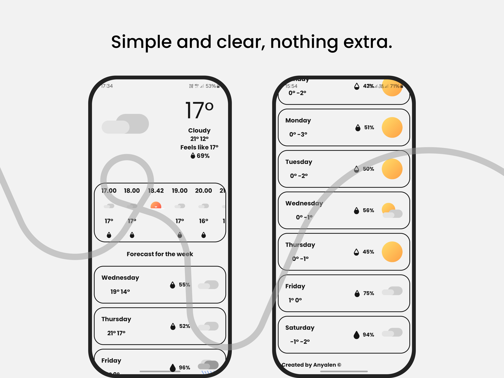
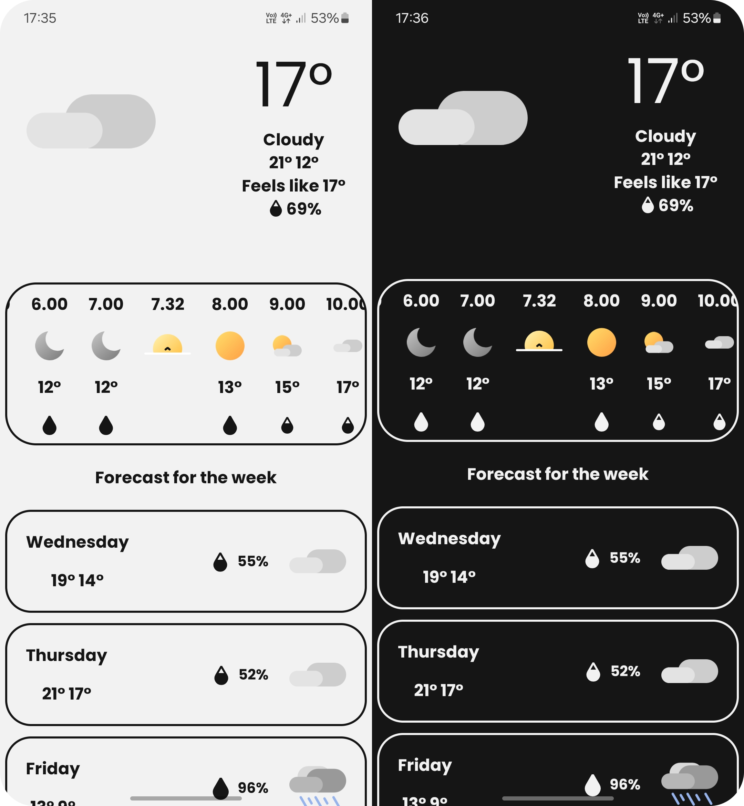
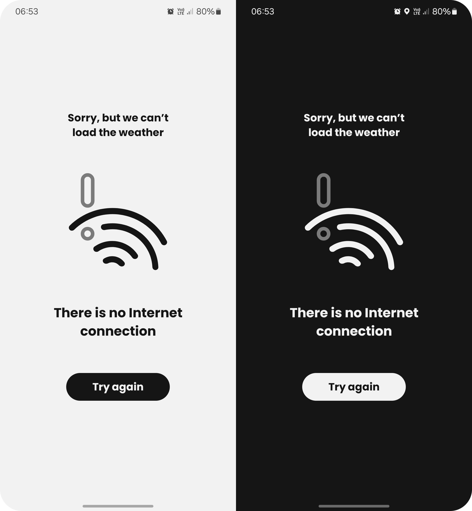

# Weather
###### Portfolio Project

**Project Overview:** A global weather application providing precise 24-hour and 7-day forecasts via OpenWeather API, with full localization for English, German, Spanish, and French.

**UI & Animations:** Developed with Jetpack Compose, featuring custom AnimatedVectorDrawable (AVD) for smooth, weather-specific visual transitions.

**Architecture & Testing:** Built on MVVM and SOLID principles with Hilt for DI, including unit testing via JUnit/Mockito and Proguard/R8 optimization.

**Tech Stack:**  
Kotlin, Jetpack Compose, MVVM, Coroutines, Flow, Hilt, Retrofit, OpenWeather API, JUnit, Mockito, AnimatedVectorDrawable, Gradle KTS.

